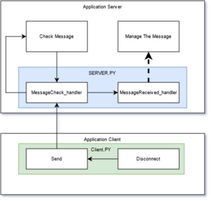

# Socket Server and Client
Is a simple class to allow the management of sending message from a client to a server. 

Create an instance of Server with your IpAdresse and an available port
and wait a client connection 

## how does it works
When a client want to send a message to the server. The client class calculate the length of the message and send it to the server and directly send the message.
the message will be encoded in UTF-8. 

The server get the message length and read the socket to get all the message. By default no check is done on the message and the message is store into a dictionnary {IP:[Message]} 
* if MessageCheck_handler is set into the server a validation occured. It's your own logical into a method with 2 parameters will be created
    * address : a tuple with ClientIP and Port 
    * msg : string with the content of the message
* if MessageReceived_handler is set into the server, an event into a thread is raised. To implement your message treatement link your method with 3 parameters : 
    * address : a tuple with Client IP and Port
    * msg : string with the content of the message 
    * all_msg : a list of message

