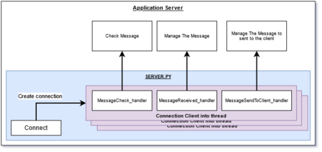

# Easy Messages
Is a simple class to allow the management of sending message from a client to a server and client can ask to receive his messages from the server.

## Server Side

Create an instance of EasyServer with your IpAdresse and an available port
and wait a client connection 

The server can link 3 handler:
* MessageCheck_handler : If you link this handler, it's possible to implement your check. This handler return a boolean to validate the message and manage 2 arguments:
    * address: tuple value contains ip adresse and connect port to respond
    * message: Message object who should checked

```python
def message_check (address, message):
    # Implement your own check return true of false
    # by default it's always true
    if message.message.startswith("<EXP>"):
        return True
    return False

serveur = Server("192.168.0.10", 5050)
serveur.MessageCheck_handler = message_check
serveur.start()
```

* MessageReceived_handler: If you link this handler, you receive the message when the server catch it. This handler return nothing and manage 2 arguments:
    * address: tuple value contains ip adresse and connect port to respond
    * message: Message object who should checked

```python
def message_received (address, message):
    # Implement your own processing of message
    print(f"New message to treat from {address}\n\t entity:{message.entity}\n\t category:{message.category}\n\t message:{message.message}")
    

serveur = Server("192.168.0.10", 5050)
serveur.MessageReceived_handler = message_received 
serveur.start()
```

* MessageSendToClient_handler: If you link this handler, the server will be able to send message at client when the client ask it. This handler return a list of Message instance and manage 3 arguments:
    * address: tuple value contains ip adresse and connect port to respond
    * entity: entity set to the message to allow to identify the messages to send (can be None)
    * category: category set to the message to allow to identify the messages to send (can be None)


```python
def message_received (address, message):
    # Implement your own processing of message
    print(f"New message to treat from {address}\n\t entity:{message.entity}\n\t category:{message.category}\n\t message:{message.message}")
    

serveur = Server("192.168.0.10", 5050)
serveur.MessageReceived_handler = message_received 
serveur.start()
```
<p align="center">

</p>


